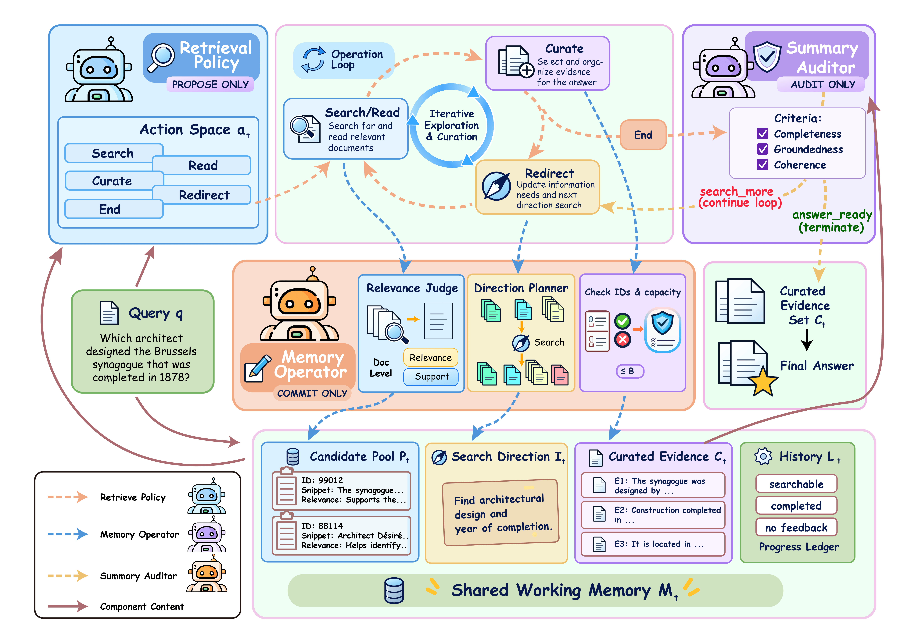
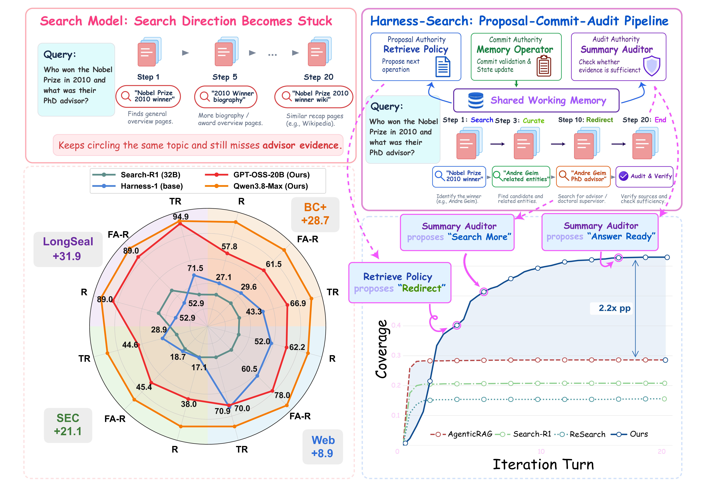

# Harness-Search

This repo is official code repo for "Harness-Search: Guiding Long-Horizon Search through Multi-Agent Coordination".

<p align="center">
  
</p>

## 🚀 Update

<strong>2026.10:</strong> We have published the Arxiv version of Harness-Search! Click the buttom above to see our paper!

## 1. Install the environment

```bash
cd Harness-Search
.venv-serve/bin/python -m pip install -r requirements-serve.txt
source .venv/bin/activate
python -m pip install --upgrade pip
python -m pip install -r requirements.txt
cp .env.example .env.local
```

## 2. Prepare datasets

We use datasets from Huggingface. Login first:
```
hf auth login
```
Web and SEC query snapshots are included under [`data/`](data/), with questions, answers, and evidence labels. Their full retrieval corpora are downloaded separately. Prepare both datasets with:

```bash
bash scripts/download_data.sh web sec
```

Download and prepare BrowseComp+ and LongSealQA data from their upstream releases:

```bash
bash scripts/download_data.sh browsecompplus
bash scripts/download_data.sh longsealqa
```

The downloader creates:

```text
data/
├── queries/
│   ├── browsecompplus/{queries.tsv,answers.jsonl,qrels_gold.txt,qrels_evidence.txt}
│   ├── web/test.parquet
│   └── sec/test.parquet
├── transfer/longseal_test.parquet
└── corpora/<dataset>/corpora/<dataset>/<split>/train-*.parquet
```
## 3. Start services

```bash
bash scripts/start_local_qdrant.sh
bash scripts/start_model_services.sh all
```

## 4. Build the BM25 index and vector database

Qdrant and the embedding endpoint must be ready. Run once for each shared corpus:

```bash
bash scripts/build_dataset_indexes.sh browsecompplus
bash scripts/build_dataset_indexes.sh web
bash scripts/build_dataset_indexes.sh sec
```

## 5. Run the full evaluation

`N_QUERIES=0` means every query in the selected split. The defaults are `all` for BrowseComp+/LongSealQA and `test` for Web/SEC.

```bash
N_QUERIES=0 bash dataset_runs/run_browsecompplus.sh
N_QUERIES=0 bash dataset_runs/run_web.sh
N_QUERIES=0 bash dataset_runs/run_sec.sh
N_QUERIES=0 bash dataset_runs/run_longsealqa.sh
```

A custom run can set its budget, concurrency, and result path:

```bash
N_QUERIES=0 MAX_TURNS=40 PARALLEL=4 OUT=outputs/web_full \
  bash dataset_runs/run_web.sh --seed 42
```

### Outputs

Each run creates `outputs/<dataset>_<timestamp>/`.

<p align="center">
  
</p>

## Acknowledgments
This repo is built from [pat-jj/harness-1](https://github.com/pat-jj/harness-1).
