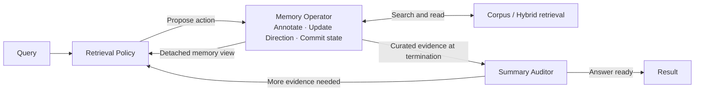

# Harness-Search

Harness-Search organizes retrieval into a **Proposal–Commit–Audit** loop. A Retrieval Policy proposes actions, a stateful Memory Operator commits evidence, and a Summary Auditor checks whether the retained evidence supports an answer. The repository includes local hybrid retrieval, dataset preparation, index builders, and evaluation on BrowseComp+, Web, SEC, and LongSealQA.



## 1. Install the environment

```bash
cd Harness-Search
python3.11 -m venv .venv
source .venv/bin/activate
python -m pip install --upgrade pip
python -m pip install -r requirements.txt
cp .env.example .env.local
```

## 2. Configure models and paths

The example configuration uses one Qwen3.5-27B chat endpoint for the Retrieval Policy, Memory Operator, and Summary Auditor. Embedding and reranking use separate endpoints.

| Service | Default model | Default endpoint |
|---|---|---|
| Policy / memory / auditor | `Qwen/Qwen3.5-27B` | `http://127.0.0.1:8000/v1` |
| Embedding | `Qwen/Qwen3-Embedding-8B` | `http://127.0.0.1:8012/v1` |
| Reranker | `Qwen/Qwen3-Reranker-8B` | `http://127.0.0.1:8011` |
| Vector database | Qdrant | `http://127.0.0.1:6333` |

## 3. Prepare datasets

Web and SEC query snapshots are included under [`datasets/`](datasets/),
with questions, answers, and evidence labels. Their full retrieval corpora are
downloaded separately. Prepare both datasets with:

```bash
bash scripts/download_data.sh web sec
```

BrowseComp+ and LongSealQA data are not included in Git. Download and prepare them from their upstream releases:

```bash
bash scripts/download_data.sh browsecompplus
bash scripts/download_data.sh longsealqa
```

The downloader creates:

```text
data/
├── queries/
│   ├── browsecompplus/{queries.tsv,answers.jsonl,qrels_gold.txt,qrels_evidence.txt}
│   ├── web/test.parquet
│   └── sec/test.parquet
├── transfer/longseal_test.parquet
└── corpora/<dataset>/corpora/<dataset>/<split>/train-*.parquet
```
## 4. Start services

Install vLLM in a separate environment for local model serving:

```bash
python3.11 -m venv .venv-serve
.venv-serve/bin/python -m pip install vllm==0.20.2
```

```bash
bash scripts/start_local_qdrant.sh
bash scripts/start_model_services.sh all
```

## 5. Build the BM25 index and vector database

Qdrant and the embedding endpoint must be ready. Run once for each shared corpus:

```bash
bash scripts/build_dataset_indexes.sh web
bash scripts/build_dataset_indexes.sh browsecompplus
bash scripts/build_dataset_indexes.sh sec
```

## 6. Run a smoke evaluation

Use a few questions before committing to a full benchmark:

```bash
N_QUERIES=3 PARALLEL=1 bash dataset_runs/run_web.sh
# Or, after downloading LongSealQA and starting only the policy service:
N_QUERIES=3 PARALLEL=1 bash dataset_runs/run_longsealqa.sh
```

## 7. Run the full evaluation

`N_QUERIES=0` means every query in the selected split. The defaults are `all` for BrowseComp+/LongSealQA and `test` for Web/SEC.

```bash
N_QUERIES=0 bash dataset_runs/run_browsecompplus.sh
N_QUERIES=0 bash dataset_runs/run_web.sh
N_QUERIES=0 bash dataset_runs/run_sec.sh
N_QUERIES=0 bash dataset_runs/run_longsealqa.sh
```

After all required datasets, indexes, and services are ready, run all four sequentially:

```bash
bash scripts/run_all.sh
```

A custom run can set its budget, concurrency, and result path:

```bash
N_QUERIES=0 MAX_TURNS=40 PARALLEL=4 OUT=outputs/web_full \
  bash dataset_runs/run_web.sh --seed 42
```

### Outputs

Each run creates `outputs/<dataset>_<timestamp>/`.
