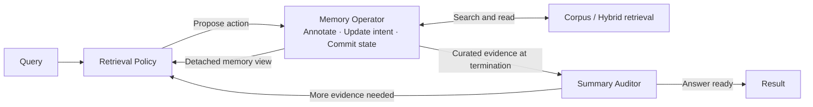

# Harness-Search

**Long-horizon retrieval with separate proposal, memory, and termination authorities.**

Harness-Search organizes retrieval into a **Proposal–Commit–Audit** loop. A Retrieval Policy proposes actions, a stateful Memory Operator commits evidence, and a Summary Auditor checks whether the retained evidence supports an answer. The repository includes local hybrid retrieval, dataset preparation, index builders, and evaluation on BrowseComp+, Web, SEC, and LongSealQA.

[Architecture](docs/architecture.md) · [Prompts](docs/prompts.md) · [Data sources & formats](docs/data.md) · [Configuration](docs/configuration.md) · [Development](CONTRIBUTING.md)



The five canonical actions are `search`, `read`, `redirect`, `curate`, and `end`. The Memory Operator owns the mutable candidate pool, curated evidence, intent, and annotations; the policy sees a detached memory view. Operational exits at budget exhaustion or auditor failure are distinguished from evidence sufficiency in the [execution semantics](docs/architecture.md).

Intent planning and document relevance annotation are internal capabilities of the
Memory Operator. They share one fixed System prompt, with operation-specific
User payloads at their respective checkpoints;
they do not constitute additional agents with independent control authority.

## 1. Install the environment

Run all commands from the repository root. Use **Linux and Python 3.11** for evaluation. You need Git, Bash, and `curl`; local model serving additionally needs compatible NVIDIA GPUs/drivers. Docker Compose is the default way to start Qdrant. Existing model and Qdrant endpoints can be used instead.

```bash
cd Harness-Search
python3.11 -m venv .venv
source .venv/bin/activate
python -m pip install --upgrade pip
python -m pip install -r requirements.txt
cp .env.example .env.local
```

`requirements.txt` installs the evaluator and data/index dependencies. The cookbook dependency is pinned to the public source revision used by this code. Tinker/Anthropic interfaces are imported for adapter compatibility; their API keys are **not required** for the local evaluation workflow.

If you only need to download data or build indexes:

```bash
python -m pip install -r requirements-data.txt
```

Install vLLM in a **separate environment** to isolate its PyTorch/CUDA dependencies:

```bash
python3.11 -m venv .venv-serve
.venv-serve/bin/python -m pip install --upgrade pip
.venv-serve/bin/python -m pip install -r requirements-serve.txt
```

The serving requirement uses vLLM 0.20.2; the existing research environment used its CUDA 12.9 build. Select a wheel compatible with your host using the [vLLM installation guide](https://docs.vllm.ai/en/latest/getting_started/installation/gpu/). Installing the evaluator does not install or start GPU services.

## 2. Configure models and paths

The example configuration uses one Qwen3.5-27B chat endpoint for the Retrieval Policy, Memory Operator (both intent updates and document annotation), and Summary Auditor. Embedding and reranking use separate endpoints.

| Service | Default model | Default endpoint |
|---|---|---|
| Policy / memory / auditor | `Qwen/Qwen3.5-27B` | `http://127.0.0.1:8000/v1` |
| Embedding | `Qwen/Qwen3-Embedding-8B` | `http://127.0.0.1:8012/v1` |
| Reranker | `Qwen/Qwen3-Reranker-8B` | `http://127.0.0.1:8011` |
| Vector database | Qdrant | `http://127.0.0.1:6333` |

Download the checkpoints, or set their local paths in `.env.local`:

```bash
hf download Qwen/Qwen3.5-27B --local-dir models/Qwen3.5-27B
hf download Qwen/Qwen3-Embedding-8B --local-dir models/Qwen3-Embedding-8B
hf download Qwen/Qwen3-Reranker-8B --local-dir models/Qwen3-Reranker-8B
```

The launcher's reference layout shares **eight GPUs** among the three models (`TENSOR_PARALLEL_SIZE=8`, memory fractions `0.55 / 0.22 / 0.22`). Adjust these settings for your hardware and checkpoint sizes. A single small GPU is not sufficient for the default models. For LongSealQA alone, only the policy/judge model is needed.

All paths default to this checkout. Set `DATA_ROOT` for a different storage volume, or copy `runtime_paths.env.example` to `runtime_paths.env` for machine-specific paths. Exported environment variables override local configuration files. See [all configuration controls](docs/configuration.md).

## 3. Prepare datasets

Web and SEC query snapshots are included under [`datasets/`](datasets/README.md),
with questions, answers, and evidence labels. Their full retrieval corpora are
downloaded separately. Prepare both datasets with:

```bash
bash scripts/download_data.sh web sec
```

This copies the bundled query files to `data/queries/` after checksum validation,
then downloads the released corpus shards. The bundled queries do not require
Hugging Face authentication. To install just the query files, without a corpus
download:

```bash
python scripts/download_queries.py web sec
```

BrowseComp+ and LongSealQA data are not included in Git. Download and prepare
them from their upstream releases:

```bash
bash scripts/download_data.sh browsecompplus
bash scripts/download_data.sh longsealqa
```

With no arguments, the downloader prepares all four datasets and stops on the
first error. Web/SEC evaluation loads only the requested test split.

| Dataset | Evaluation selection | Shared corpus | Index required |
|---|---|---|---|
| BrowseComp+ | All 830 released queries | 1,144,886 chunks | BM25 + Qdrant |
| Web | 554 test queries | 54,735 test-corpus chunks | BM25 + Qdrant |
| SEC | 691 queries in the bundled local test snapshot | 2,115,106 train-corpus chunks used for retrieval | BM25 + Qdrant |
| LongSealQA | All rows of the `longseal` release | Per-query documents bundled with each question | No shared index |

Corpus counts refer to the [released chunked corpora](https://huggingface.co/datasets/pat-jj/harness-1-train-data). LongSealQA uses its answer-bearing pages together with the distractor documents and shuffles their order. Its query count follows the downloaded upstream revision.

**Split identity:** the bundled SEC snapshot contains 691 queries and is not
claimed to be the 502-query `sec_test_new` split described in the upstream
reference setup. Its original upstream revision was not recorded. Report the
snapshot checksum and query count when using it. No training splits are bundled:
the available local Web train file was a placeholder, and the SEC train file
duplicated its test file. See [dataset provenance](datasets/README.md).

To explicitly fetch upstream Web/SEC queries, use
`python scripts/download_queries.py --upstream web sec --output data/upstream_queries`.
Restricted upstream sources may require an authorized `HF_TOKEN` or
`hf auth login`. See [data sources and formats](docs/data.md).

The downloader creates:

```text
data/
├── queries/
│   ├── browsecompplus/{queries.tsv,answers.jsonl,qrels_gold.txt,qrels_evidence.txt}
│   ├── web/test.parquet
│   └── sec/test.parquet
├── transfer/longseal_test.parquet
└── corpora/<dataset>/corpora/<dataset>/<split>/train-*.parquet
```

BrowseComp+ query fields are de-obfuscated locally according to the [dataset authors' format](https://huggingface.co/datasets/Tevatron/browsecomp-plus). Only the two Web/SEC query snapshots under `datasets/` are tracked. Downloaded data under `data/`, decoded BrowseComp+ content, LongSealQA data, corpora, checkpoints, caches, and experiment outputs are excluded from source control.

## 4. Start services

```bash
bash scripts/start_local_qdrant.sh
bash scripts/start_model_services.sh all
```

The first command starts the Qdrant service from `compose.yaml` if the configured local endpoint is unavailable. Qdrant persists data under `data/qdrant_storage/`. Set `QDRANT_IMAGE` to a specific image tag or digest to pin a reproduction; the convenience default is `qdrant/qdrant:latest`. See the [Qdrant quickstart](https://qdrant.tech/documentation/quickstart/).

Model services run in the background and write logs/PIDs to `tmp/service_logs/`. The launcher reuses already responding local ports, so ensure their served model names match your configuration. The services stay running after evaluation.

```bash
curl -fsS http://127.0.0.1:8000/v1/models
curl -fsS http://127.0.0.1:8012/v1/models
curl -fsS http://127.0.0.1:8011/v1/models
curl -fsS http://127.0.0.1:6333/collections
```

For index construction only, use `bash scripts/start_model_services.sh retrieval`. For LongSealQA only, use `bash scripts/start_model_services.sh policy` and skip Qdrant/index construction. If using existing endpoints, configure them in `.env.local` and skip the local launchers; evaluation does not start services unless `AUTO_START_MODELS=1` is set.

## 5. Build the BM25 index and vector database

Qdrant and the embedding endpoint must be ready. Run once for each shared corpus:

```bash
bash scripts/build_dataset_indexes.sh web
bash scripts/build_dataset_indexes.sh browsecompplus
bash scripts/build_dataset_indexes.sh sec
```

Each command validates the corpus count, builds the BM25 index, obtains dense embeddings, and uploads them to Qdrant. The evaluator and builder use the same dataset-to-index mapping:

| Dataset | BM25 directory | Qdrant collection |
|---|---|---|
| BrowseComp+ | `data/indexes/browsecompplus/bm25` | `browsecompplus_qwen3_embedding_8b_4096_local` |
| Web | `data/indexes/web/bm25` | `web_test_1_17_qwen3_embedding_8b_4096_full` |
| SEC | `data/indexes/sec/bm25` | `sec_1_4_qwen3_embedding_8b_4096_full` |

Dense vectors are cached under `data/indexes/<dataset>/embedding_cache/`. After an interrupted dense build, rerun the same command: the builder replays deterministic point IDs and reuses cached vectors, including when parallel requests completed out of order. It rejects changed cache configurations. Use a new `INDEX_ROOT` and `DATASET_QDRANT_COLLECTION` when changing the corpus or embedding model; rebuilding BM25 is required when chunk IDs/order change.

These are large builds, especially SEC. BM25 tokenization materializes corpus text in RAM. A 4,096-dimensional float32 vector needs 16 KiB before database overhead; SEC alone needs about 32 GiB for one vector copy, and the embedding cache adds another copy. Plan substantial RAM and SSD space for corpus text, indexes, caches, and model weights. `INDEX_CONCURRENCY=2` reduces concurrent embedding requests.

LongSealQA skips this entire step. For low-level options:

```bash
python scripts/build_dataset_bm25.py --help
python scripts/build_dataset_qdrant.py --help
```

## 6. Run a smoke evaluation

Use a few questions before committing to a full benchmark:

```bash
N_QUERIES=3 PARALLEL=1 bash dataset_runs/run_web.sh
# Or, after downloading LongSealQA and starting only the policy service:
N_QUERIES=3 PARALLEL=1 bash dataset_runs/run_longsealqa.sh
```

Inspect the resolved command without starting services or making model calls:

```bash
DRY_RUN=1 bash dataset_runs/run_web.sh
DRY_RUN=1 bash scripts/build_dataset_indexes.sh web
```

The smoke evaluation still uses the **complete** corpus index. Low-level `--limit` index builds are development artifacts and need separate directories/collections; they are not valid full-benchmark retrieval settings.

## 7. Run the full evaluation

`N_QUERIES=0` means every query in the selected split. The defaults are `all` for BrowseComp+/LongSealQA and `test` for Web/SEC.

```bash
N_QUERIES=0 bash dataset_runs/run_browsecompplus.sh
N_QUERIES=0 bash dataset_runs/run_web.sh
N_QUERIES=0 bash dataset_runs/run_sec.sh
N_QUERIES=0 bash dataset_runs/run_longsealqa.sh
```

After all required datasets, indexes, and services are ready, run all four sequentially:

```bash
bash scripts/run_all.sh
```

A custom run can set its budget, concurrency, and result path:

```bash
N_QUERIES=0 MAX_TURNS=40 PARALLEL=4 OUT=outputs/web_full \
  bash dataset_runs/run_web.sh --seed 42
```

The common evaluation entry point is `scripts/run_eval.sh <dataset>`. Additional arguments are forwarded to `python -m runner.evaluate`; inspect them with `python -m runner.evaluate --help`. Use `QUERY_IDS="id1 id2"` for specific questions. `POLICY_PROTOCOL=qwen_chat` is the default for Qwen chat checkpoints; `vllm_tokens` is available for compatible Harmony/token-serving policies.

### Outputs

Each run creates `outputs/<dataset>_<timestamp>/`:

```text
eval.log                    Human-readable progress and diagnostics
eval_results.partial.jsonl  One result appended per completed query
eval_results.json           Per-query results plus _summary aggregate metrics
trajectories/               Saved action/observation traces
```

Results include retrieval/curation metrics, answer metrics where applicable, judge call counts, termination information, and the latest audit. See `runner/evaluate.py` for exact definitions; local answer normalization/EM/F1 is not the official semantic grader of every benchmark. Inspect auditor verdicts as well as aggregate scores—budget/error exits are not answer-ready certificates.

Partial results survive interruption, but evaluation does **not** automatically resume from them. Select unfinished query IDs and a new output directory to continue. Reusing `OUT` appends partial records and overwrites final results/logs.

## Repository layout

```text
harness_search/       Retrieval Policy, Memory Operator, Summary Auditor, tools, prompts
runtime/              Harness state machine and action checkpoints
runner/               Evaluation and result aggregation
datagen/              Dataset adapters and evaluation labels
datasets/             Bundled Web/SEC test queries, checksums, and provenance
dataset_runs/         Thin launchers for the four documented benchmarks
scripts/              Downloads, model services, index builds, evaluation
tests/                Offline unit and workflow regression tests
docs/                 Architecture, data contracts, and configuration reference
```

## Development and provenance

```bash
python -m unittest discover -s tests -v
python -m compileall -q harness_search runtime runner datagen scripts
```

Tests use synthetic data and mocked model calls; they do not launch models or run the full benchmark. See [CONTRIBUTING.md](CONTRIBUTING.md) for source-export checks. Preserve upstream notices listed in [THIRD_PARTY.md](THIRD_PARTY.md); dataset and model licenses are separate from code licensing.
